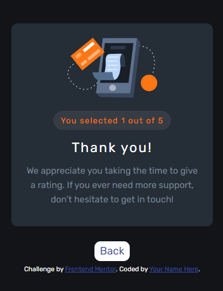

# Frontend Mentor - Interactive rating component solution

This is a solution to the [Interactive rating component challenge on Frontend Mentor](https://www.frontendmentor.io/challenges/interactive-rating-component-koxpeBUmI). Frontend Mentor challenges help you improve your coding skills by building realistic projects. 

## Table of contents

- [Frontend Mentor - Interactive rating component solution](#frontend-mentor---interactive-rating-component-solution)
  - [Table of contents](#table-of-contents)
  - [Overview](#overview)
    - [The challenge](#the-challenge)
    - [Screenshot](#screenshot)
    - [Links](#links)
  - [My process](#my-process)
    - [Built with](#built-with)
  - [Author](#author)

## Overview

### The challenge

Users should be able to:

- View the optimal layout for the app depending on their device's screen size
- See hover states for all interactive elements on the page
- Select and submit a number rating
- See the "Thank you" card state after submitting a rating

### Screenshot

### Links

- Solution URL: (https://github.com/hernanruscica/frontend_mentor_Interactive_rating_component)
- Live Site URL: (https://hernanruscica.github.io/frontend_mentor_Interactive_rating_component/)

## My process
  I started with the mobile layout first, keeping in mind the sizes of the requested viewports of the examples.
  I made two different pages for each component, this way I use less javascript and the code is neater, in pure HTML.
  It has some javascript for the functionality of sending the score to the "thanks" page. I use the localStorage to pass the selected score to the second page.
  For the css I use the BEM nomenclature and custom variables.

### Built with

- Semantic HTML5 markup
- CSS custom properties
- Flexbox
- Mobile-first workflow

## Author

- Website - [Cesar Hernan Ruscica](http://ruscica-code.ar/)
- Frontend Mentor - [@hernanruscica](https://www.frontendmentor.io/profile/hernanruscica)
- GitHub - [@hernanruscica](https://github.com/hernanruscica)

